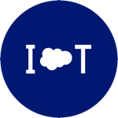

Platform Event Usage Monitor
=======
With the previous release of Salesforce, we introduced the Salesforce Enterprise Messaging Platform `EMP` and the events that run on it `Platform Events`.

Unfortunately platform events are short lived (sub 24 hours) and are not logged anywhere in the Salesforce system unless strictly subscribed to. Thus not only is it hard to track these events but you also have no ability to debug if these events are coming to your org and hitting the various systems that digest the events. This unmanaged package exists to remedy some of those issues.

The unmanaged, when installed, offers a Visualforce page that allows you to create [APEX triggers](https://developer.salesforce.com/docs/atlas.en-us.apexcode.meta/apexcode/apex_triggers.htm) on your [Platform Events](https://developer.salesforce.com/docs/atlas.en-us.platform_events.meta/platform_events/platform_events_intro_emp.htm), a Custom Salesforce Object to track these Platform Events and an Einstein Analytics App with Einstein Analytics Dashboard in your org. It is recommended to create the Apex Triggers on *all* of your platform events and a Einstein Analytics App that lets you monitor the platform events and their count.

## Table of Contents

   * [Platform Event Usage Monitor](#platform-event-usage-monitor)
      * [Getting Started](#getting-started)
         * [Prerequisites](#prerequisites)
         * [Installing](#installing)
         * [Setup Process](#setup-process)
      * [Metadata](#metadata)
         * [Fields](#fields)
         * [Code](#code)
         * [Resources](#resources)
         * [Pages](#pages)
         * [Wave Components](#wave-components)
         * [Permission Settings](#permission-settings)
         * [Objects](#objects)
         * [Tabs](#tabs)


## Getting Started

This package is intended for admins who have access to Platform Events and Einstein Analytics.

### Prerequisites
```
- Einstein Analytics
- Platform Events
- Salesforce System Admin Access
- Wave Admin Access
```

### Installing

The org should be setup with Einstein Analytics. This means that the org has the necessary licenses and the feature is enabled in the setup tree. The user that is downloading the managed package should also have have the Einstein Analytics admin perms assigned to them so they can execute/load dataflows. In addition, the org has at least one Platform Events to create Apex Triggers on.

Click the link below to deploy the metadata in this package into your org. If unsuccessful you should see a warning on this Heroku app.

<a href="https://githubsfdeploy.herokuapp.com">
  
</a>

### Setup Process

If your org meets the requirements above, follow these steps after the package is installed:

Open Developer console.

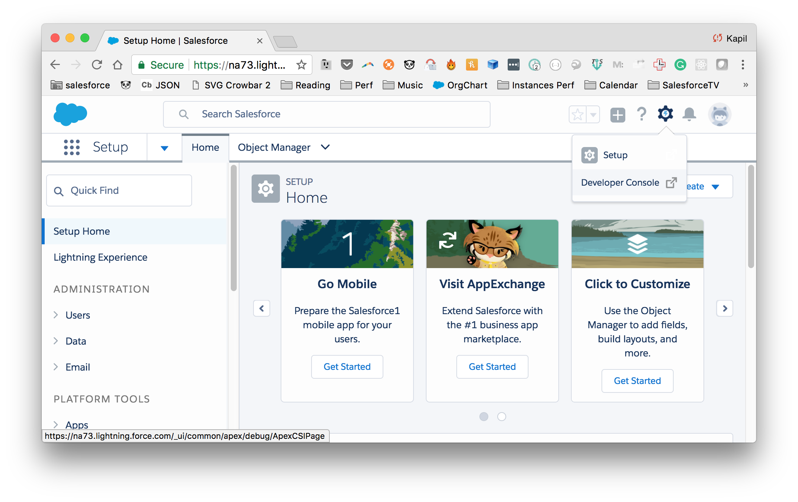

Open Execute Anonymous window. Make sure to the check the `open log` option and then execute the following statement: `System.debug(URL.getSalesforceBaseUrl().toExternalForm());`. This returns the base URL of your org.

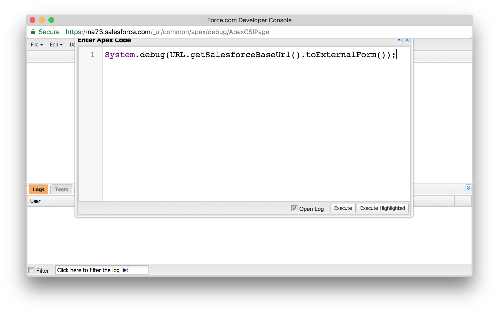


Copy the URL from the debug log.

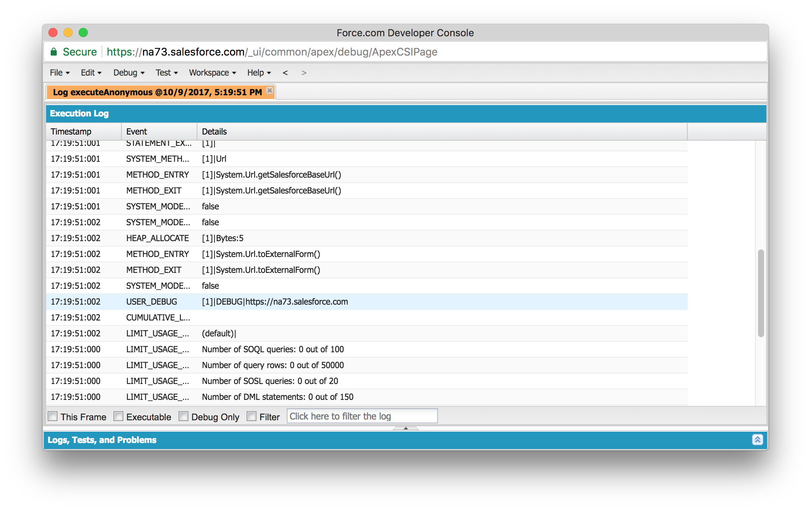

Go to Setup and search for Remote Site Settings. On this page add your url as a remote site.

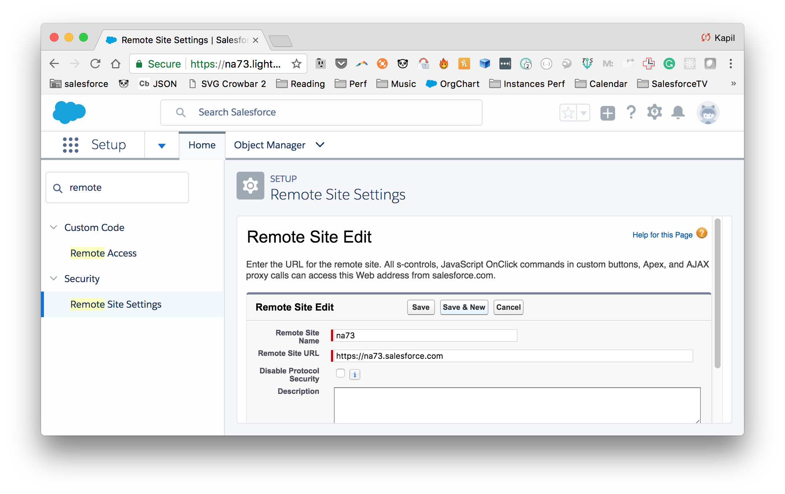

Assign yourself the PlatformEventMonitorAdminUser permission set.
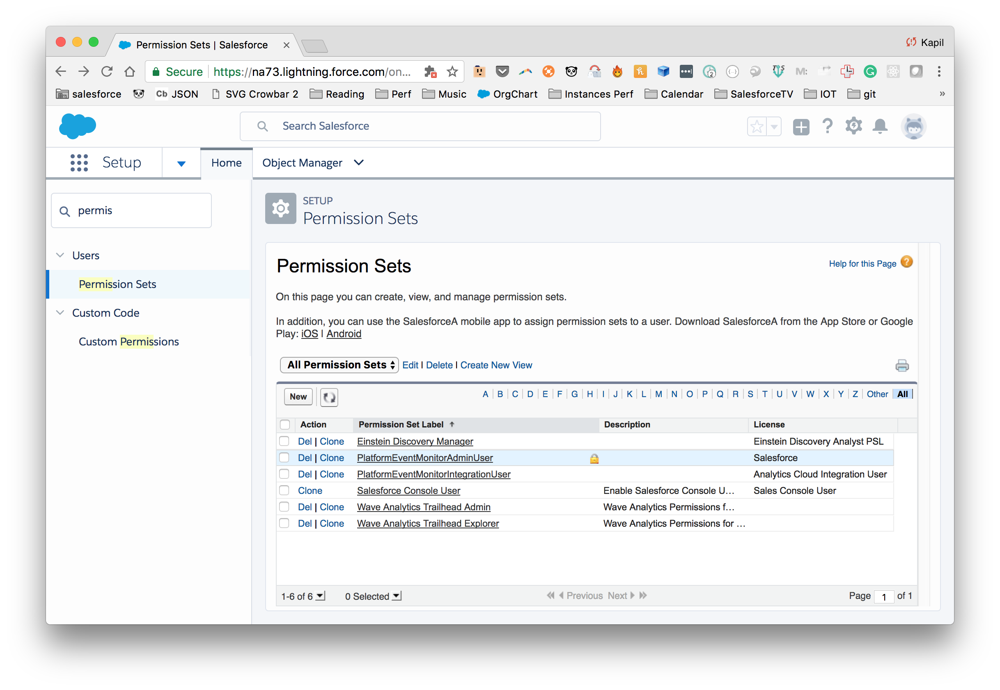
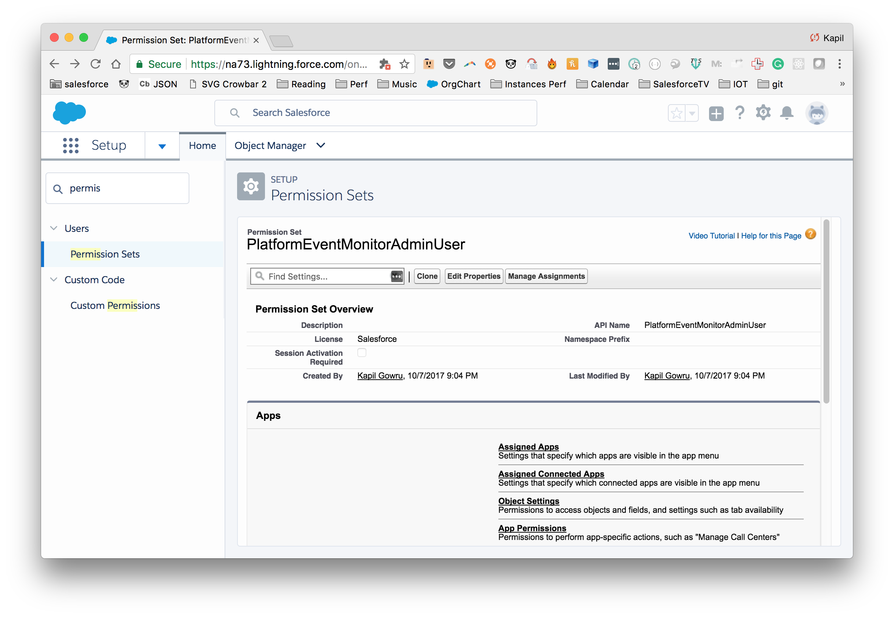
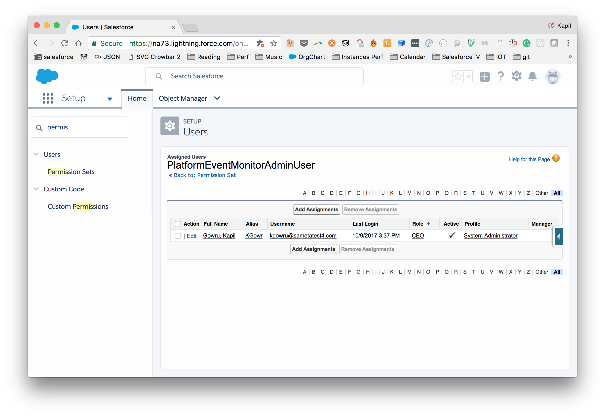

Then assign the Einstein Analytics `Integration User` (Analytics Cloud Integration User) and Einstein Analytics `Security User` (Analytics Cloud Security User) the PlatformEventMonitorIntegrationUser permission set.
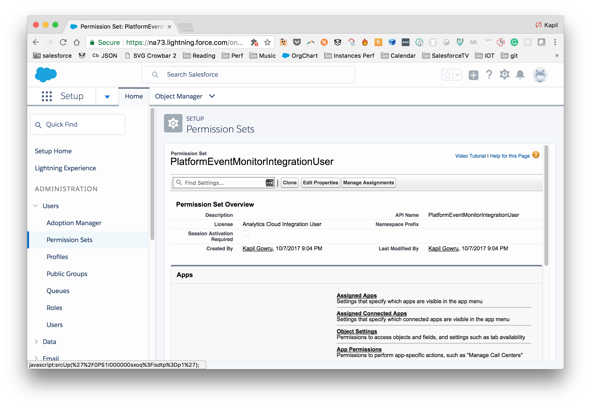
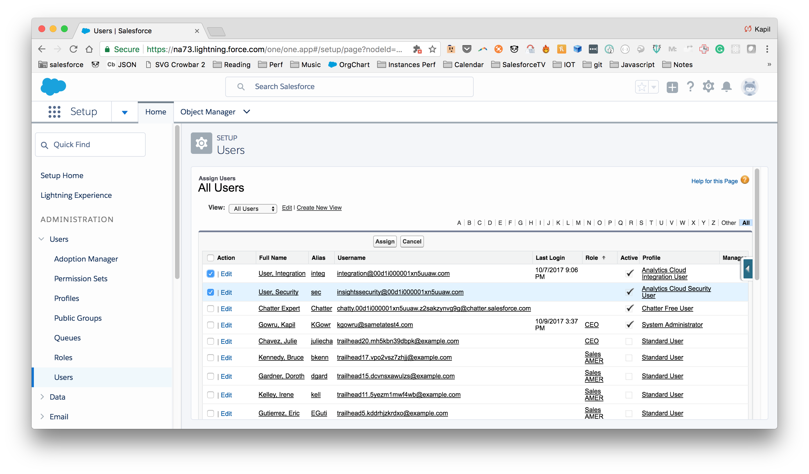

After that go to the CreateApexTriggers tab, choose your platform events and then click on the 'Create Triggers' button. You should now have ApexTriggers created for each of the chosen platform events to monitor counts.
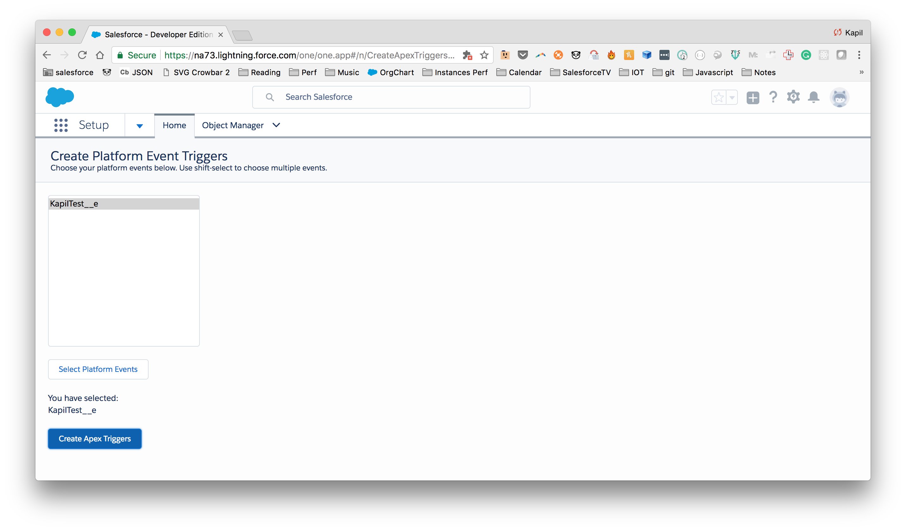

Schedule your Einstein Analytics Dataflow to run at a scheduled time to create the required dataset for the Einstein Analytics Dashboard.
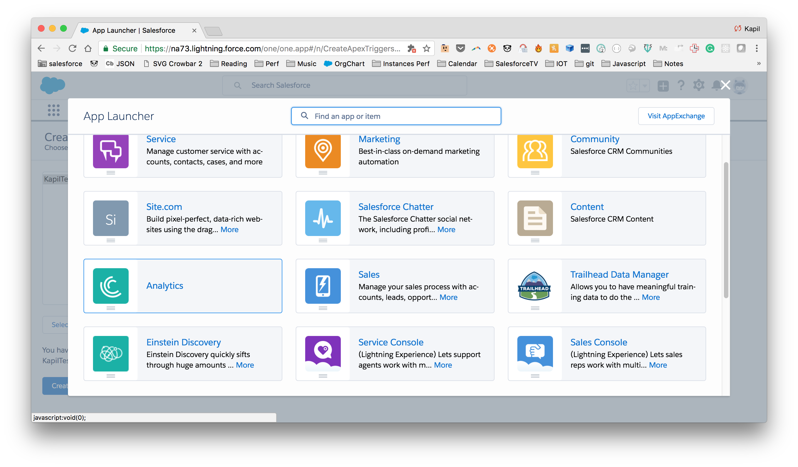
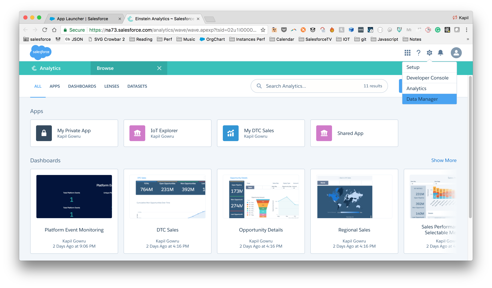
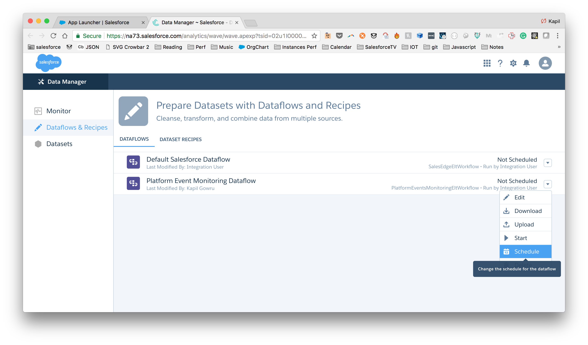
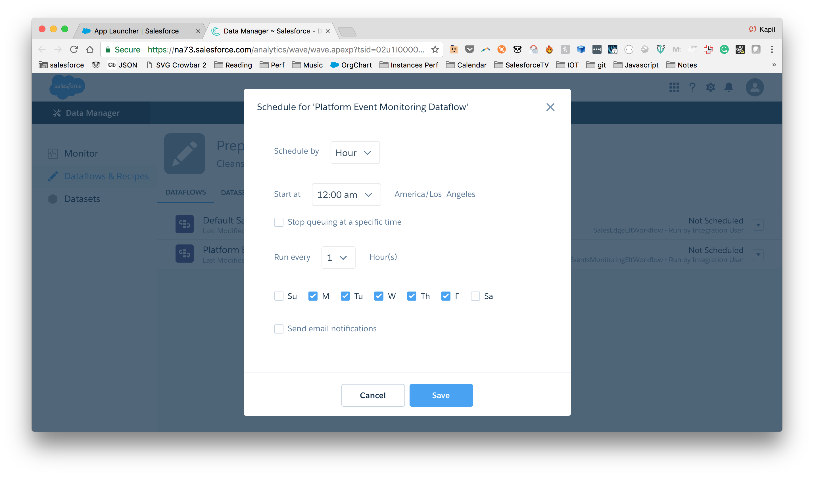


If you want to get immediate data you can run the Dataflow now by choosing `start` in the dropdown.


When the Einstein Analytics Dataflow is completed, you should be able to open the Platform Event Monitoring dashboard and see this.
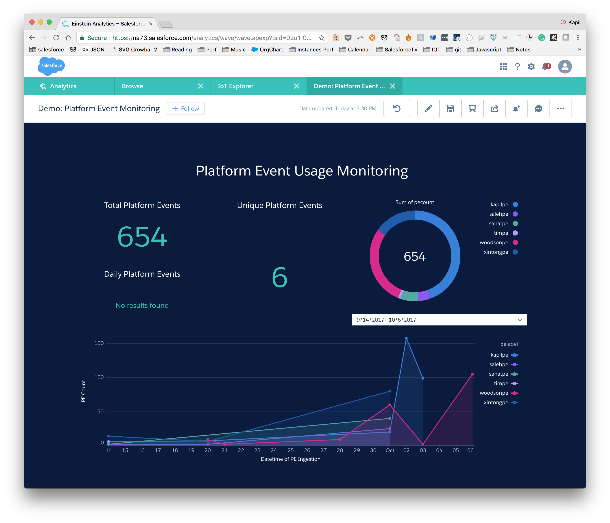

Note: This doesn't count previously sent platform events and only captures platform events after the install of this package.

## Metadata

This is all of the metadata that will deploy on your org.

### Fields

| Component Name | Parent Object  | Component Type  |
|------|---|---|
|pepayload      | CountPlatformEvent  |  Custom Field |
| pename     |  CountPlatformEvent |  Custom Field |
| pedatetime     | CountPlatformEvent  |  Custom Field |
|pelabel   |  CountPlatformEvent | Custom Field  |
|pecount   |  CountPlatformEvent | Custom Field  |

### Code

| Component Name | Parent Object  | Component Type  |
|------|---|---|
|CreatePEApexTriggersController      |   |  Apex Class |
| CreatePEApexTriggersTest     |   |  Apex Class |
| ExampleCalloutMock     |   |  Apex Class |

### Resources

| Component Name | Parent Object  | Component Type  |
|------|---|---|
|CustomPlatformEvent Layout      |CountPlatformEvent   |  Page Layout |
| All     |  CountPlatformEvent |  	List View |

### Pages

| Component Name | Parent Object  | Component Type  |
|------|---|---|
|CreatePEApexTriggersPage      |   |  Visualforce Page|

### Wave Components

| Component Name | Parent Object  | Component Type  |
|------|---|---|
|IoT_Explorer      |   | Wave Application |
|CountPlatformEventObjects   |   | Wave Dataset  |
|PlatformEventsMonitoringEltWorkflow   |   | Wave Dataflow  |
| Platform_Event_Monitoring  |   |Wave Lens   |
|SalesEdgeEltWorkflow   |   | Wave Dataflow  |

### Permission Settings

| Component Name | Parent Object  | Component Type  |
|------|---|---|
|PlatformEventMonitorAdminUser      |   | Permission Set |
|PlatformEventMonitorIntegrationUser   |   | Permission Set  |

### Objects

| Component Name | Parent Object  | Component Type  |
|------|---|---|
|CountPlatformEvent      |   | Custom Object |

### Tabs

| Component Name | Parent Object  | Component Type  |
|------|---|---|
|CountPlatformEvent      |   | Tab |
|CreateApexTriggers   |   | Tab  |
